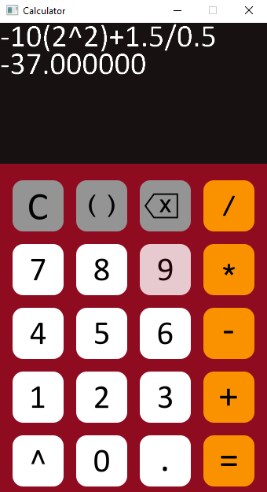
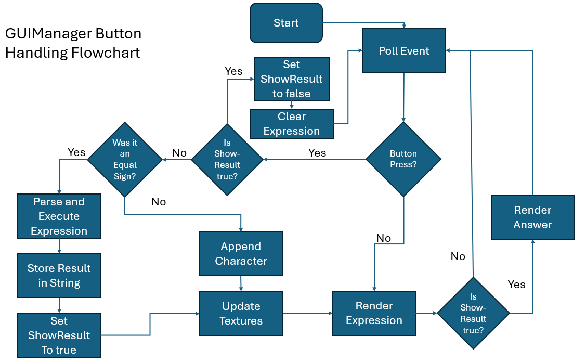

<base target="_blank">

# GUI Calculator
## Description
A simple 5-function GUI calculator made with SDL2 by me. 
The program utilizes a [modified shunting yard algorithm](https://en.wikipedia.org/wiki/Shunting_yard_algorithm) to parse mathematical expressions to convert an expression to reverse Polish notation. The windowing, graphics rendering, and mouse input is handled by the SDL library. Since the library is platform-independent, the project can be built and executed on Windows, Linux, and MacOS.

Along with the SDL main library, the project utilizes SDL_image for png loading and SDL_ttf for rendering text. I decided to use SDL due to its platform independence, and I have added it as a git submodule, which means that the project takes up quite a lot of space. I don't know if there is a better way to add these dependencies, but it 
was the easiest way I could think of doing it.

For the future, I realize that adding SDL as a submodule is not a good idea, especially the development version of the library. Instead, if I were to use it, it should be as a precompiled library.

*CMake version higher than 3.18 is required.*

### Features
- Basic mathematical expressions like addition, subtraction, multiplication, and division, along with exponentiation.
- Uses double-precision.
- Follows order of operations and allows for the use of parenthesis.
- Supports unary operators such as + and -.

## Screenshots/clips


## Building
If you do not have SDL, SDL_image, and SDL_ttf installed on your system, you'll have to clone the repository with the submodules.
```console
$ git clone --recurse-submodules https://github.com/AliceAch/GUICalc.git
```
Otherwise clone the repository without recursing submodules.
### Linux/MacOS
```console
$ mkdir build && cd build
$ cmake ..
$ cmake --build .
```
the executable will be in src/
If using system libraries, add the flag -DUSE_SYSTEM_SDL=ON
### Windows
Open the project with Visual Studio. Make sure you have the CMake C++ tools installed.
build the executable using Visual Studio's CMake integration:
https://learn.microsoft.com/en-us/cpp/build/cmake-projects-in-visual-studio?view=msvc-170#building-cmake-projects

## Design

## Issues
I know the the code is far from perfect, but it is my first project using SDL and C++. Looking back on it there were some decisions that I made that I realize make no sense and complicate a simple process. There are some issues and missing features that I have identified:
1. There is no code to handle lost focus and minimization, making it unstable.
2. No keyboard support.
3. There is no cap to the length of expressions, meaning they can go off screen
4. Trailing zeroes.
5. Errors are not handled properly.
6. Large code size
7. SDL_ttf depends on freetype and it looks for it if it is installed on the system, can fail sometimes on Ubuntu

There are a lot more I would add in the future, but I got bored of working on this project. Some additional features I would add is a history of executed expressions and using mouse clicks to copy results. Instead of storing expressions as string streams, expressions should be stored as a list of tokens (removing the need for a scanner) and piping the expression directly to the parser, this does complicate the rendering however.

Also I'm not a graphic designer as you can see 😅.
